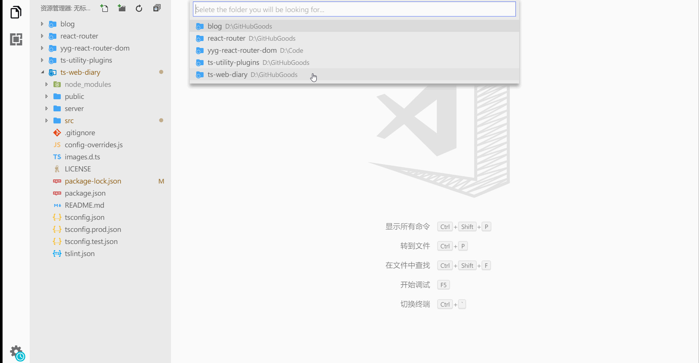

# File Positioning

  

## Features

Have you tried looking for specific files in a large workspace folder? It may be a confusing problem.

Now, `file-positioning` can help you to find the file, just like this:

## Release Notes

@see [CHANGELOG](./CHANGELOG.md)

## LICENSE

@see [MIT](./LICENSE)

**Enjoy!**
